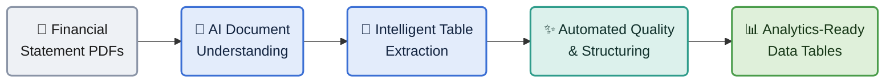

# Solution Overview — PDF to Analytics-Ready Data

An AI-powered pipeline that turns financial-statement PDFs into clean, structured,
analytics-ready data — automatically.

**The flow, in plain terms:** financial-statement PDFs go in → AI reads and understands
each document → tables are extracted into structured records → results are automatically
cleaned, normalized, and multi-page tables stitched together → the output is governed,
query-ready data for analytics and reporting.
